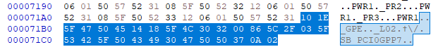
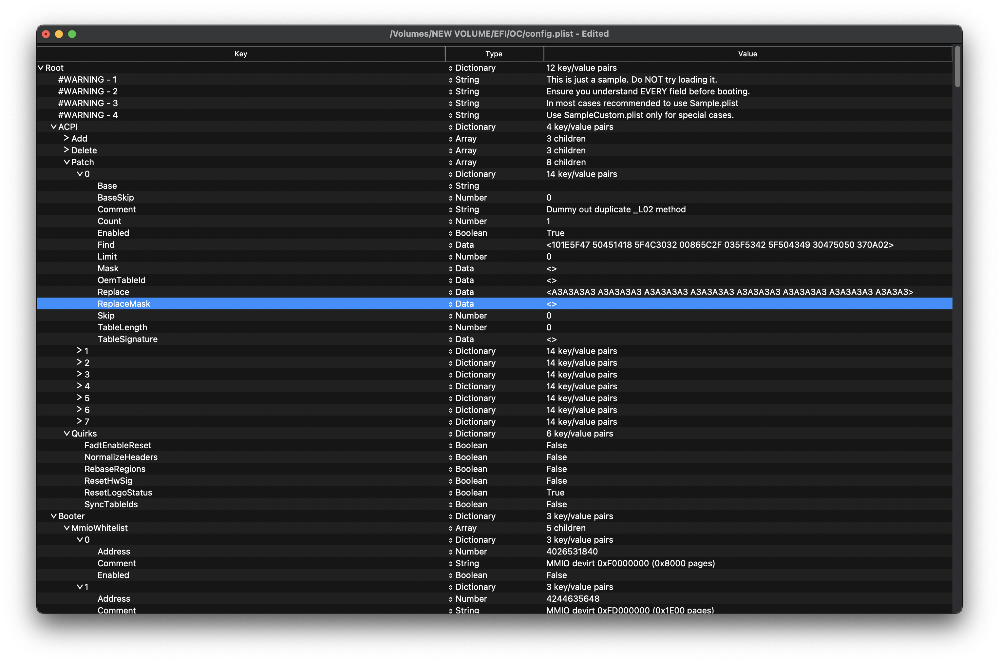

# hackintosh-ryzen-7900x-msi-mag-b650m-mortar
### Ryzentosh with AMD Ryzen™ 7 7900X &amp; MSI MAG B650M MORTAR WIFI
 


All files will be found [here](EFI).

## Resources
- [OpenCore guide](https://dortania.github.io/OpenCore-Install-Guide/)
- [Ryzentosh guide](https://github.com/mikigal/ryzen-hackintosh)
- [r/hackintosh](https://reddit.com/r/hackintosh/)
- [config.plist parser](https://sanitychecker.ocutils.me/)
- AMD OS X Discord

## What works and doesn't work?

### Working
- Asrock Challenger Pro RX 6800 3x DisplayPort and 1x HDMI output
- GPU Acceleration and DRM
- CPU Power Management
- 2.5G onboard LAN
- Sleep/wake
- USB 3.0/3.1/3.2
- Both NVMe slots
- Brightness control using [MonitorControl](https://github.com/MonitorControl/MonitorControl/releases)
- FocusRite Scarlett Solo USB Interface

### Not working
- Wi-Fi/Bluetooth (in the future, we can replace MSI's RZ616 with a [BCM94350ZAE](https://www.aliexpress.com/i/32800008617.html))
- LCD for Lian Li Galahad AIO

### Not tested
- Front Panel/Motherboard Audio


## The Build Itself

OpenCore Version: 1.0.0

Operating Systems: Windows 11, macOS Sonoma 14.5

SMBIOS: MacPro7,1

### Parts used for macOS [some not included because not needed]

| Part Type   | Part Model                                                            |
|-------------|-----------------------------------------------------------------------|
| Motherboard | MSI MAG B650M MORTAR WIFI                                             |
| BIOS        | 7D76vAH2(Beta version 2024-07-18)                                     |
| CPU         | AMD Ryzen 9 7900X                                                     |
| GPU         | AMD Radeon™ RX 6800 Challenger Pro 16G OC                             |
| RAM         | G.SKill Trident Z5 Neo RGB 32GB (2 x 16GB) DDR5 6000MHz CL30          |
| NVMe 1      | SK Hynix BC511 256GB [macOS Drive]                                    |
| NVMe 2      | Crucial P3 Plus 2TB [Windows Drive]                                   |
| Wi-Fi/BT    | RZ616 [Non-functional in macOS]                                       |
| Network     | Realtek® RTL8125B 2.5Gbps LAN                                         |
| Audio       | Realtek ALC4080   [Untested, I use USB Audio]                         |


## OpenCore Configuration

### ACPI

| ACPIs                    |
|--------------------------|
| SSDT-CPUR.aml            |
| SSDT-EC-USBX-DESKTOP.aml |

#### Delete

Thanks to @Cerbis from the AMD OS X Discord, we need to drop SSDT13 to prevent a namespace lookup failure. 

It defines two devices for _SB_.PCI0.GPP7.UP00.DP40.UP00.DP68, one named PTIO and one named SPTO, but using iASL we find that the only references to the two devices exist in SSDT13 shown below.

This means that we can 100% just entirely drop this SSDT. It doesn't do anything anyway. Fully vestigial.

``` 
DefinitionBlock ("", "SSDT", 1, "AMD", "AmdTable", 0x00001000)
{
    External (_SB_.PCI0.GPP7.UP00.DP40.UP00.DP68, DeviceObj)

    Scope (\_SB)
    {
        Device (PTIO)
        {
...
    Scope (\_SB.PCI0.GPP7.UP00.DP40.UP00.DP68)
    {
        Name (SPTS, 0x0F)
        Device (SPTO)
        {
...
```
The iASL decompiler provides us with the values we need to add in config.plist under ACPI/Delete 
```
/*
 * Intel ACPI Component Architecture
 * AML/ASL+ Disassembler version 20230628 (32-bit version)
 * Copyright (c) 2000 - 2023 Intel Corporation
 * 
 * Disassembling to symbolic ASL+ operators
 *
 * Disassembly of C:/Users/trixy/Desktop/Sec89ACPI/SSDT13.aml, Sat Aug  3 10:33:44 2024
 *
 * Original Table Header:
 *     Signature        "SSDT"
 *     Length           0x00000114 (276)
 *     Revision         0x01
 *     Checksum         0x1B
 *     OEM ID           "AMD"
 *     OEM Table ID     "AmdTable"
 *     OEM Revision     0x00001000 (4096)
 *     Compiler ID      "INTL"
 *     Compiler Version 0x20120913 (538052883)
 */
 ```

| All        | Comment      | Enabled          | OemTableId         | TableLength         | TableSignature |
|------------|--------------|------------------|--------------------|---------------------|----------------|
| False      | Drop SSDT13  | True             | 416D6454 61626C65  | 276                 | 53534454       |

#### Patch
Thanks to @Cerbis again we find that a duplicate _L02 method in the DSDT for MSI's MAG B650M MORTAR is casuing a namespace lookup failure 

```
Scope (_GPE)
    {

    71AE: 10 1E 5F 47 50 45                                // .._GPE

        Method (_L02, 0, NotSerialized)  // _Lxx: Level-Triggered GPE, xx=0x00-0xFF
        {

    71B4: 14 18 5F 4C 30 32 00                             // .._L02.

            Notify (\_SB.PCI0.GPP7, 0x02) // Device Wake
        }
    }
}
```

We will take all the bytes of the DSDT _L02 method and replace them with NoOp bytes using the following entry under ACPI/Patch

We can add the -l flag to iASL to get a mixed output DSL file where it will also print the machine code for each disassembled section. Using a hex editor, we see the problematic code:
 

```
<array>
    <dict>
        <key>Base</key>
        <string></string>
        <key>BaseSkip</key>
        <integer>0</integer>
        <key>Comment</key>
        <string>Dummy out duplicate _L02 method</string>
        <key>Count</key>
        <integer>1</integer>
        <key>Enabled</key>
        <true/>
        <key>Find</key>
        <data>101E5F47 50451418 5F4C3032 00865C2F 035F5342 5F504349 30475050 370A02</data>
        <key>Limit</key>
        <integer>0</integer>
        <key>Mask</key>
        <data></data>
        <key>OemTableId</key>
        <data></data>
        <key>Replace</key>
        <data>A3A3A3A3 A3A3A3A3 A3A3A3A3 A3A3A3A3 A3A3A3A3 A3A3A3A3 A3A3A3A3 A3A3A3</data>
        <key>ReplaceMask</key>
        <data></data>
        <key>Skip</key>
        <integer>0</integer>
        <key>TableLength</key>
        <integer>0</integer>
        <key>TableSignature</key>
        <data></data>
    </dict>
</array>
</plist>
```
config.plist should look something like this

### Drivers

| Driver Name     |
|-----------------|
| HfsPlus         |
| OpenCanopy      |
| OpenRuntime     |

### Kernel Patches

[AMD Vanilla Patches](https://github.com/AMD-OSX/AMD_Vanilla/tree/master)

### Kexts


| Kext Name                             |
|---------------------------------------|
| AppleMCEReporterDisabler              |
| Innie                                 |
| Lilu                                  |
| LucyRTL8125Ethernet                   |
| NVMeFix                               |
| RestrictEvents                        |
| SMCProcessorAMD (note the order)      |
| USBMap                                |
| VirtualSMC                            |
| WhateverGreen                         |

### Booter
#### MmioWhitelist

You need to follow the mmio whitelist guide [here](https://dortania.github.io/OpenCore-Install-Guide/extras/kaslr-fix.html) to have the correct values in Booter/MmioWhitelist otherwise you will hang at EB LOG while booting the macOS installer.

For Ryzen 7000 series you can try my values in config.plist as they should be similar, otherwise use memmap and DIY (all information is in that link above).